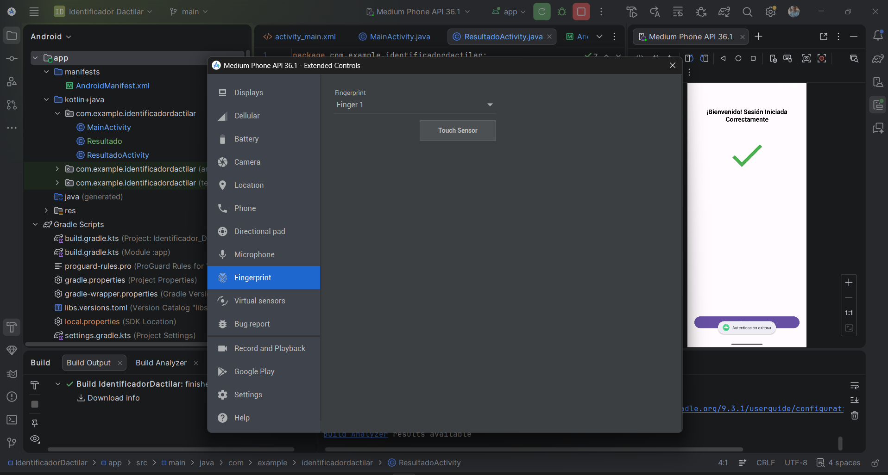

# Identificador Dactilar - Autenticación Biométrica en Android

Este proyecto es una aplicación nativa en **Android (Java)** desarrollada para la asignatura de **Desarrollo de Aplicaciones Biométricas**. Permite autenticar a un usuario mediante el lector de huella dactilar nativo del dispositivo (`FingerprintManager` / `BiometricPrompt`).

---

## 📱 Funcionalidades y Comportamiento Programado

1. **Pantalla de Inicio de Sesión (`MainActivity`):**
   * **Huella no registrada / Fallida (`onAuthenticationFailed`):** 
     - Actualiza el mensaje en pantalla: *"Escaneo fallido, huella dactilar no registrada"*.
     - Cambia el `ImageView` al ícono de error (`icono_incorrecto`).
   * **Huella registrada / Exitosa (`onAuthenticationSucceeded`):**
     - Muestra un aviso flotante Toast: `"Autenticación exitosa"`.
     - Cambia el `ImageView` al ícono de éxito (`icono_correcto`).
     - Muestra el texto: *"¡Escaneo de huella dactilar exitoso! \n Iniciando sesión…"*.
     - Redirige automáticamente a la pantalla de bienvenida (`ResultadoActivity`).

2. **Pantalla de Bienvenida (`ResultadoActivity`):**
   * Muestra la pantalla de bienvenida tras un acceso exitoso.
   * Cuenta con un botón que ejecuta `acceptButton()` para regresar al inicio de sesión y reiniciar el flujo.

---

## 📸 Evidencia de Funcionamiento

A continuación se muestra la evidencia de la aplicación corriendo en un dispositivo físico con autenticación exitosa:



---

## 🛠️ Tecnologías y Requisitos

* **Lenguaje:** Java
* **Servicio Biométrico:** `FingerprintManager` / `BiometricPrompt`
* **Permisos:** `android.permission.USE_FINGERPRINT`
* **Compatibilidad:** Android 6.0 (API Level 23) o superior con hardware de huella dactilar.

---

## 🚀 Instalación y Ejecución

1. Clonar este repositorio:
   ```bash
   git clone https://github.com/JMCS1/IdentificadorDactilar.git
   ```
2. Abrir el proyecto en **Android Studio**.
3. Sincronizar Gradle y ejecutar la app en un emulador configurado con Fingerprint o en un dispositivo físico con depuración USB activada.
